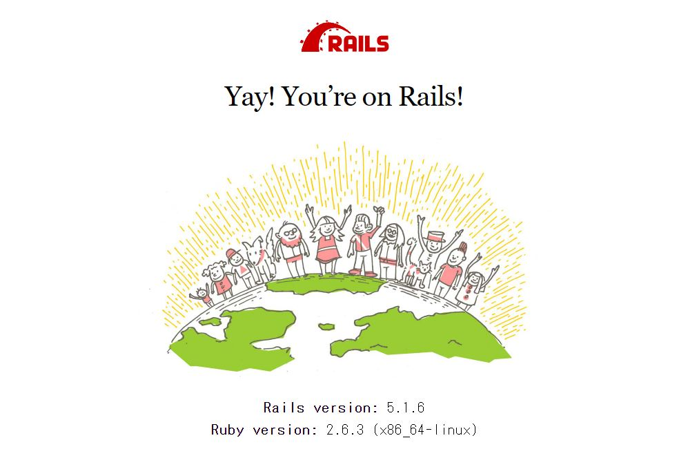

https://railstutorial.jp/chapters/beginning?version=5.1#cha-beginning

演習1.1.2を実施

クラウド上のIDEを使う。（WSL上で環境構築する気マンマンだった…）AWSでCloud9の環境を作成。

インデントをスペース2に変更。

Railsをインストール。

最初のアプリを作ってみる。
→hello_appを作成。

`~> 4.0.0` は「4.0.0より大きく、4.1より小さい」の意味。

バージョンをチュートリアルのものと揃えるため、Gemfileの中身を置き換える。

`bundle install`時にエラー

```bash
$ bundle install
The dependency tzinfo-data (>= 0) will be unused by any of the platforms Bundler is installing for. Bundler is installing for ruby but the dependency is only for x86-mingw32, x86-mswin32, x64-mingw32, java. To add those platforms to the bundle, run `bundle lock --add-platform x86-mingw32 x86-mswin32 x64-mingw32 java`.
Fetching gem metadata from https://rubygems.org/...........
Fetching gem metadata from https://rubygems.org/.
You have requested:
  spring = 2.0.2

The bundle currently has spring locked at 2.1.1.
Try running `bundle update spring`

If you are updating multiple gems in your Gemfile at once,
try passing them all to `bundle update`
```

指示通り`bundle update spring`してみる

```bash
$ bundle update spring
The dependency tzinfo-data (>= 0) will be unused by any of the platforms Bundler is installing for. Bundler is installing for ruby but the dependency is only for x86-mingw32, x86-mswin32, x64-mingw32, java. To add those platforms to the bundle, run `bundle lock --add-platform x86-mingw32 x86-mswin32 x64-mingw32 java`.
Fetching gem metadata from https://rubygems.org/...........
Fetching gem metadata from https://rubygems.org/.
Resolving dependencies...
Bundler could not find compatible versions for gem "activesupport":
  In snapshot (Gemfile.lock):
    activesupport (= 5.1.7)

  In Gemfile:
    rails (= 5.1.6) was resolved to 5.1.6, which depends on
      activesupport (= 5.1.6)

    coffee-rails (= 4.2.2) was resolved to 4.2.2, which depends on
      railties (>= 4.0.0) was resolved to 5.1.7, which depends on
        activesupport (= 5.1.7)

Running `bundle update` will rebuild your snapshot from scratch, using only
the gems in your Gemfile, which may resolve the conflict.
```

またエラー…`bundle update`で解消するかな？
その後もう一度`bundle install`してみる。→いけたみたい

Railsサーバーを実行する→`rails server`
[Preview]>[Preview Running Application]を選択
出てきたブラウザの右上の矢印マーク[Pop Out into New Window]をクリック
Railsのデフォルトページが表示された


MVCのお勉強
いまはコントローラーは一つしかない
```
$ ls app/controllers/*_controller.rb
app/controllers/application_controller.rb
```

Applicationコントローラにhello関数を定義

ルーターのルーティングを変更

デフォルトページでhello worldが表示された

gitのセットアップ

ユーザー名とメアドの設定
初めてのコミット
うっかり削除したときのリカバリー

Bitbucketへのアップロード
(デフォルトですべてのリポジトリがprivateなので、GithubでなくBitbucketを採用している)

cloud9上でssh鍵作成
> https://git-scm.com/book/ja/v2/Git%E3%82%B5%E3%83%BC%E3%83%90%E3%83%BC-SSH-%E5%85%AC%E9%96%8B%E9%8D%B5%E3%81%AE%E4%BD%9C%E6%88%90

BitBucketにssh鍵を登録

新しいリポジトリ作成
初めてのpush

modify-READMEブランチを作成
(一時的なブランチ＝トピックブランチ)

README.mdを編集
cloud9上でもVSCodeみたいに[Preview]からマークダウンのプレビューが見れる

`git commit -a`でaddとcommitを同時にできる

`git branch -d`でmpdify-READMEブランチを削除
`-D`オプションで、変更をマージしていなくてもブランチを削除できる

変更をpush

Herokuにデプロイする
